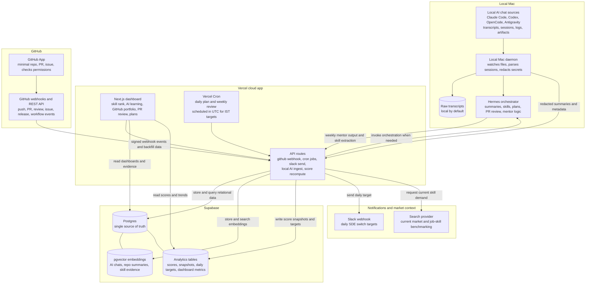

# DevRank OS Architecture Decision Diagram

Source: `Task.md` section 1, "Architecture Decisions".

## Operating Decision

- Supabase Postgres with pgvector is the database for local development and hosted environments.
- Vercel keeps GitHub tracking, dashboards, score snapshots, and Slack daily targets running when the Mac is off.
- The Local Mac daemon owns local transcript discovery and raw transcript custody.
- Hermes is the reasoning and orchestration layer, not the database.
- GitHub App webhooks handle event-driven repo and PR updates; REST backfill fills historical data.
- Vercel cron schedules stay in UTC and must be mapped carefully to India time.
